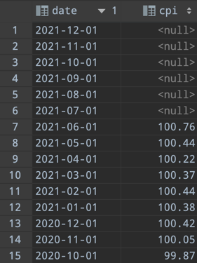

# CPI parser

> Project work on the academic practice of the 2nd year of the HSE university

## Description

[Rosstat](https://rosstat.gov.ru/) web-scraper for obtaining official published inflation values.

Since Rosstat doesn't have its own API, in order to conveniently obtain official data on Russian inflation today, you
need to contact financial analytical companies and pay for their data. This script receives official values using
web-scraping, extracting the Excel tables from the HTML code and processing them into a convenient format.

Final product: weekly **cron-job** for collecting and updating data.

## Technology stack

- python3
- requests
- BeautifulSoup
- pandas, numpy
- SQLAlchemy

## Launch instruction

1. Install [python3](https://www.python.org/)

2. Clone the repository and change the directory
   ```bash
   $ git clone https://github.com/sd-denisoff/cpi-parser.git && cd cpi-parser
   ```

3. Create a virtual environment and activate it
   ```bash
   $ virtualenv --python=python3 venv
   $ source venv/bin/activate
   ```

4. Install dependencies
   ```bash
   $ pip3 install -r requirements.txt
   ```

5. Run the script
   ```bash
   $ python3 rosstat_parser.py
   ```

Web-scraping result:



Developed by [Stepan Denisov](https://t.me/sd_denisoff 'telegram')